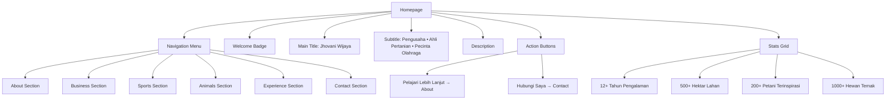
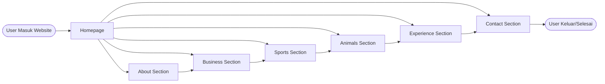
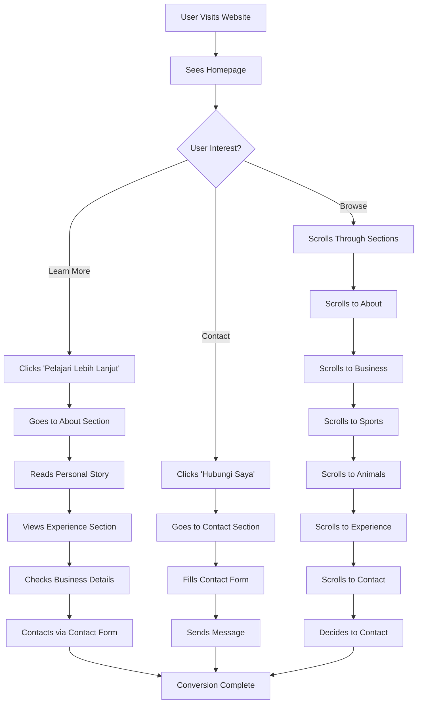
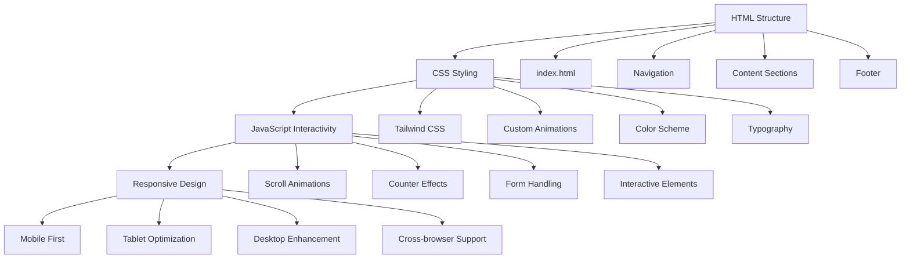
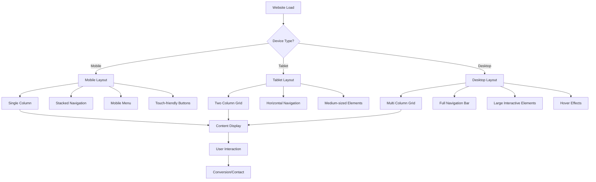

# Flowchart Website Portfolio Jhovani Wijaya

## Struktur Website

## Alur Navigasi

## Struktur Konten

```mermaid
flowchart TD
    A[Website Portfolio Jhovani Wijaya] --> B[Homepage]
    A --> C[About Section]
    A --> D[Business Section]
    A --> E[Sports Section]
    A --> F[Animals Section]
    A --> G[Experience Section]
    A --> H[Contact Section]
    
    B --> B1[Welcome Message]
    B --> B2[Personal Introduction]
    B --> B3[Key Statistics]
    B --> B4[Call-to-Action Buttons]
    
    C --> C1[Personal Journey]
    C --> C2[Background Story]
    C --> C3[Values & Mission]
    C --> C4[Skills Tags]
    
    D --> D1[Agriculture Business]
    D --> D2[Livestock Business]
    D --> D3[Sustainable Practices]
    D --> D4[Business Achievements]
    
    E --> E1[Football Passion]
    E --> E2[Futsal Experience]
    E --> E3[Team Leadership]
    E --> E4[Sports Achievements]
    
    F --> F1[Cat Care]
    F --> F2[Chicken Farming]
    F --> F3[Bird Keeping]
    F --> F4[Animal Welfare]
    
    G --> G1[Career Timeline]
    G --> G2[Major Achievements]
    G --> G3[Leadership Roles]
    G --> G4[Community Impact]
    
    H --> H1[Contact Information]
    H --> H2[Social Media Links]
    H --> H3[Contact Form]
    H --> H4[Location Details]
```

## User Journey

## Technical Flow

## Content Hierarchy

```mermaid
flowchart TD
    A[Website Portfolio] --> B[Header/Navigation]
    A --> C[Main Content]
    A --> D[Footer]
    
    B --> B1[Logo/Brand]
    B --> B2[Navigation Menu]
    B --> B3[Mobile Menu]
    
    C --> C1[Homepage Hero]
    C --> C2[About Section]
    C --> C3[Business Section]
    C --> C4[Sports Section]
    C --> C5[Animals Section]
    C --> C6[Experience Section]
    C --> C7[Contact Section]
    
    C1 --> C1a[Welcome Message]
    C1 --> C1b[Personal Introduction]
    C1 --> C1c[Key Statistics]
    C1 --> C1d[Call-to-Action]
    
    C2 --> C2a[Personal Journey]
    C2 --> C2b[Background Story]
    C2 --> C2c[Values & Mission]
    
    C3 --> C3a[Agriculture]
    C3 --> C3b[Livestock]
    C3 --> C3c[Sustainability]
    
    C4 --> C4a[Football]
    C4 --> C4b[Futsal]
    C4 --> C4c[Leadership]
    
    C5 --> C5a[Cats]
    C5 --> C5b[Chickens]
    C5 --> C5c[Birds]
    
    C6 --> C6a[Career Timeline]
    C6 --> C6b[Achievements]
    C6 --> C6c[Community Impact]
    
    C7 --> C7a[Contact Info]
    C7 --> C7b[Social Media]
    C7 --> C7c[Contact Form]
    
    D --> D1[Copyright]
    D --> D2[Additional Links]
    D --> D3[Social Media Icons]
```

## Responsive Design Flow

---

## Keterangan Flowchart

### 1. **Struktur Website**
- Menunjukkan hubungan antara homepage dan semua section
- Menggambarkan komponen utama di homepage

### 2. **Alur Navigasi**
- Menunjukkan bagaimana user berpindah antar section
- Alur linear dari homepage ke contact

### 3. **Struktur Konten**
- Detail konten di setiap section
- Hierarki informasi yang disampaikan

### 4. **User Journey**
- Jalur yang diambil user saat mengunjungi website
- Titik-titik konversi dan interaksi

### 5. **Technical Flow**
- Komponen teknis yang membangun website
- Teknologi yang digunakan

### 6. **Content Hierarchy**
- Struktur konten dari level tertinggi ke terendah
- Organisasi informasi

### 7. **Responsive Design Flow**
- Adaptasi website untuk berbagai device
- Optimasi untuk mobile, tablet, dan desktop

Flowchart ini membantu memahami struktur, alur, dan organisasi website portfolio Jhovani Wijaya secara visual dan sistematis.
